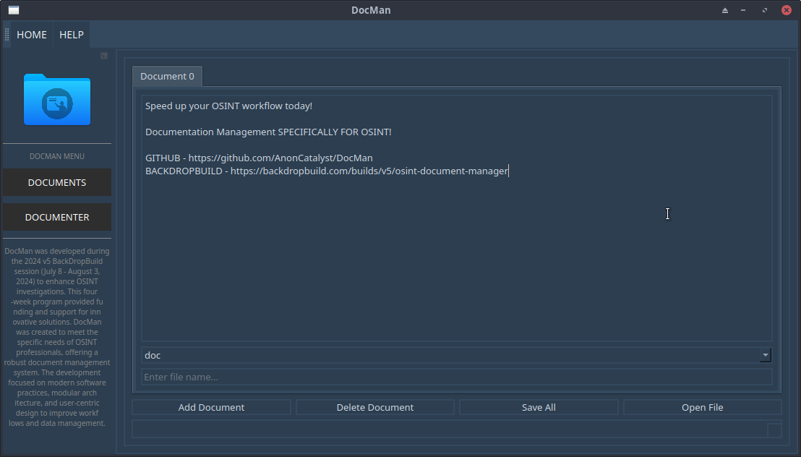

# DocMan: OSINT Document Manager

DocMan is a document management system designed to streamline workflows and improve efficiency in OSINT investigations. Developed as a result of participation in the BackDropBuild v5 session from July 8th to August 3rd, DocMan provides a centralized interface for managing, editing, and organizing documents, facilitating collaboration and enhancing productivity.

## BackDropBuild v5 Session

BackDropBuild v5 is a collaborative session focused on developing tools and solutions for enhancing OSINT capabilities. Held from July 8th to August 3rd, the session aims to address challenges in open-source intelligence gathering by fostering innovation and collaboration among participants.

Learn more about [BackDropBuild](https://backdropbuild.com).

Explore the specific build session for DocMan at [BackDropBuild v5 - OSINT Document Manager](https://backdropbuild.com/builds/v5/osint-document-manager).

## What is BackDropBuild?

BackDropBuild is an initiative that brings together experts and enthusiasts in various fields to collaborate on developing innovative tools and solutions for specific challenges. It provides a platform for intensive sessions, such as v5, which focuses on advancing OSINT capabilities through creative and collaborative efforts.

## Why DocMan?

DocMan stands out as a dedicated tool tailored specifically to speed up OSINT documentation workflows. Each feature in DocMan contributes to this goal:

- **Centralized Document Repository:** Provides quick access to all documents related to an investigation, reducing time spent searching for information.
  
- **Document Templates:** Standardizes reporting formats, saving time on formatting and ensuring consistency in documentation.
  
- **Version Control and Collaboration Tools:** Facilitates real-time collaboration among team members, enhancing efficiency in document review and updates.
  
- **Integrated Editor:** Offers formatting and styling options directly within the application, eliminating the need to switch between tools for document editing.
  
- **Real-Time Collaboration and Commenting:** Enables instant feedback and discussion on documents, speeding up the review process.
  
- **Customizable Dashboard:** Tailors the interface to individual workflow preferences, optimizing user interaction and task management.
  
- **Role-Based Access Control:** Ensures secure and controlled access to sensitive information, maintaining data integrity and compliance.

By focusing on these specific needs of OSINT practitioners, DocMan enhances workflow efficiency, accuracy, and collaboration in document management, making it an indispensable tool for accelerating investigative processes.

